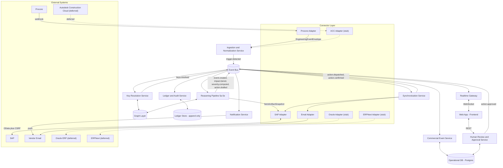

# Downstream — Implementation Blueprint
### Tech Lead handoff · translation only, nothing redesigned

Every name, field, service boundary, and topic below is taken directly from the frozen design (Product Design, Systems Architecture, Connector Layer Validation, Reference Execution Trace, Implementation Backlog). Where a genuinely new decision was unavoidable — a primary key format, a container image base, a folder name — it is a pure implementation detail with zero effect on the architecture, and is marked as such. Scope follows the Implementation Backlog exactly: Milestone 1 builds only what the Reference Trace exercises (Procore + email + SAP); every deferred item from that backlog stays deferred here, present in the structure as a labeled stub, not built.

---

## 1. High-level architecture diagram

**Mermaid** (renders natively on GitHub/GitLab; import into **draw.io** via *Extras → Edit Diagram*, paste this code block, and draw.io will render it as an editable diagram):



**Diagram legend:** solid arrows are real, active paths in Milestone 1 (see §9); dotted arrows mark connectors present in the repository as stubs but not wired into any milestone yet. Nothing dotted requires future redesign — it requires implementing the same `Connector Interface` (§7) a second, third, and fourth time.

---

## 2. Repository structure

A single monorepo. The reasoning: every service shares three things — the envelope schemas, the domain object model, and the event contracts — and a monorepo keeps those three shared packages version-locked across every consumer instead of drifting across separate repos.

```
downstream/
├── apps/
│   ├── connector-procore/
│   ├── connector-sap/
│   ├── connector-email/
│   ├── connector-acc/            # stub only, not wired into Milestone 1
│   ├── connector-oracle/         # stub only
│   ├── connector-erpnext/        # stub only
│   ├── ingestion-service/
│   ├── key-resolution-service/
│   ├── reasoning-pipeline/
│   ├── commercial-event-service/
│   ├── ledger-service/
│   ├── realtime-gateway/
│   ├── notification-service/
│   ├── approval-service/
│   ├── synchronization-service/
│   └── web/
├── packages/
│   ├── envelope-schemas/         # EngineeringEventEnvelope, CommercialArtifactSnapshot
│   ├── connector-interface/      # the shared adapter contract every connector implements
│   ├── domain-models/            # Trigger, CommercialEvent, Impact, Action, Approval
│   ├── event-contracts/          # one schema file per topic in §8
│   └── shared-config/
├── infra/
│   ├── docker-compose.yml
│   ├── migrations/
│   └── mocks/
│       ├── mock-engineering-system/   # Mock Procore, per the Connector Validation
│       └── mock-erp/                  # Mock SAP, per the Connector Validation
├── docs/                          # the six frozen design documents, unmodified
└── README.md
```

---

## 3. Folder structure per application

**Every backend service follows one template**, because every one of them is, structurally, "consume from the bus or an API, do one bounded thing, write to one store, emit to the bus":

```
apps/<service-name>/
├── src/
│   ├── domain/        # the entities and rules this service owns
│   ├── consumers/      # event bus subscriptions, one file per topic consumed
│   ├── publishers/     # event bus emissions, one file per topic produced
│   ├── api/             # only present if the service exposes a synchronous endpoint
│   ├── repository/     # database access, one file per table owned
│   └── config/
├── migrations/          # only present if this service owns tables (see §6 ownership)
├── tests/
│   ├── contract/        # tests run against both the mock and, later, the real system
│   └── unit/
└── Dockerfile
```

**Connector adapters** follow the same shape with one addition — every adapter implements the shared `connector-interface` package, never its own bespoke contract:

```
apps/connector-<system>/
├── src/
│   ├── inbound/         # webhook receiver, or polling scheduler if no webhook exists
│   ├── client/           # the outbound REST/OData client to the real (or mock) system
│   ├── mapper/           # raw payload -> EngineeringEventEnvelope or CommercialArtifactSnapshot
│   ├── idempotency/     # the connector-level dedup cache (Phase 1.1 of the Reference Trace)
│   └── config/
├── tests/contract/       # run against infra/mocks/, and later against a real sandbox tenant
└── Dockerfile
```

**The frontend** is organized by the three exercised surfaces first, with the deferred pages present as empty route stubs so the navigation shell never needs rework later:

```
apps/web/
├── src/
│   ├── pages/
│   │   ├── commercial-state/     # built, Milestone 1
│   │   ├── event-inbox/          # built, Milestone 1
│   │   ├── event-detail/         # built, Milestone 1 (Evidence Explorer lives here as a panel)
│   │   ├── integrations/         # stub route, deferred
│   │   ├── project-graph/        # stub route, deferred
│   │   ├── timeline/             # stub route, deferred
│   │   └── settings/             # stub route, deferred
│   ├── realtime/                 # the WebSocket client and local event-log state store
│   ├── api-client/
│   └── components/
├── public/
└── Dockerfile
```

---

## 4. Docker Compose architecture

Deferred connectors are declared with a `profile` rather than omitted — present in the file, not started by `docker compose up` unless explicitly requested. This is the container-level expression of the same discipline the Implementation Backlog used at the service level.

```yaml
version: "3.9"

networks:
  downstream-net:

volumes:
  postgres-data:
  graph-data:

services:
  # ---------- Infrastructure ----------
  event-bus:
    image: bitnami/kafka:latest
    networks: [downstream-net]
    ports: ["9092:9092"]

  operational-db:
    image: postgres:16
    environment:
      POSTGRES_DB: downstream_operational
    volumes: ["postgres-data:/var/lib/postgresql/data"]
    networks: [downstream-net]

  ledger-db:
    image: postgres:16
    environment:
      POSTGRES_DB: downstream_ledger
    networks: [downstream-net]

  graph-db:
    image: neo4j:5
    volumes: ["graph-data:/data"]
    networks: [downstream-net]

  # ---------- Mocks (Connector Layer Validation) ----------
  mock-engineering-system:
    build: ./infra/mocks/mock-engineering-system
    networks: [downstream-net]
    ports: ["4001:4001"]

  mock-erp:
    build: ./infra/mocks/mock-erp
    networks: [downstream-net]
    ports: ["4002:4002"]

  # ---------- Connectors (Milestone 1) ----------
  connector-procore:
    build: ./apps/connector-procore
    depends_on: [event-bus, mock-engineering-system]
    networks: [downstream-net]

  connector-sap:
    build: ./apps/connector-sap
    depends_on: [event-bus, mock-erp]
    networks: [downstream-net]

  connector-email:
    build: ./apps/connector-email
    depends_on: [event-bus]
    networks: [downstream-net]

  # ---------- Connectors (stubs, opt-in only) ----------
  connector-acc:
    build: ./apps/connector-acc
    profiles: ["deferred"]
    networks: [downstream-net]

  connector-oracle:
    build: ./apps/connector-oracle
    profiles: ["deferred"]
    networks: [downstream-net]

  connector-erpnext:
    build: ./apps/connector-erpnext
    profiles: ["deferred"]
    networks: [downstream-net]

  # ---------- Core services ----------
  ingestion-service:
    build: ./apps/ingestion-service
    depends_on: [event-bus, operational-db]
    networks: [downstream-net]

  key-resolution-service:
    build: ./apps/key-resolution-service
    depends_on: [event-bus, graph-db]
    networks: [downstream-net]

  reasoning-pipeline:
    build: ./apps/reasoning-pipeline
    depends_on: [event-bus, graph-db, connector-sap]
    networks: [downstream-net]

  commercial-event-service:
    build: ./apps/commercial-event-service
    depends_on: [event-bus, operational-db]
    networks: [downstream-net]

  ledger-service:
    build: ./apps/ledger-service
    depends_on: [event-bus, ledger-db]
    networks: [downstream-net]

  realtime-gateway:
    build: ./apps/realtime-gateway
    depends_on: [event-bus]
    ports: ["4100:4100"]
    networks: [downstream-net]

  notification-service:
    build: ./apps/notification-service
    depends_on: [event-bus]
    networks: [downstream-net]

  approval-service:
    build: ./apps/approval-service
    depends_on: [event-bus, operational-db]
    ports: ["4200:4200"]
    networks: [downstream-net]

  synchronization-service:
    build: ./apps/synchronization-service
    depends_on: [event-bus, connector-sap, connector-email]
    networks: [downstream-net]

  # ---------- Frontend ----------
  web:
    build: ./apps/web
    depends_on: [approval-service, realtime-gateway]
    ports: ["3000:3000"]
    networks: [downstream-net]
```

(A standalone, directly usable copy of this file is provided alongside this document.)

---

## 5. Service-to-service communication map

**Asynchronous, over the Event Bus** — this is the primary communication style, per the Systems Architecture's choreography model:

| Producer | Topic | Consumer(s) |
|---|---|---|
| Ingestion & Normalization | `trigger.detected` | Key Resolution |
| Key Resolution | `keys.resolved` | Reasoning Pipeline |
| Reasoning Pipeline | `event.created` | Commercial Event Service, Ledger, Realtime Gateway |
| Reasoning Pipeline | `impact.tiered` | Commercial Event Service, Ledger, Realtime Gateway |
| Reasoning Pipeline | `severity.computed` | Commercial Event Service, Notification, Ledger, Realtime Gateway |
| Reasoning Pipeline | `action.drafted` | Commercial Event Service, Ledger |
| Approval Service | `action.approved` | Synchronization Service, Ledger |
| Synchronization Service | `action.dispatched` | Ledger, Realtime Gateway |
| Synchronization Service | `action.confirmed` | Commercial Event Service, Ledger, Realtime Gateway |
| Commercial Event Service | `event.closed` | Ledger, Realtime Gateway |

**Synchronous, direct calls** — used only where a human or an external system is waiting on an immediate response, per the Systems Architecture's stated exception to choreography:

| Caller | Callee | Why synchronous |
|---|---|---|
| Web App | Approval Service (`GET /events/{id}`, `POST /actions/{id}/approve`) | A human is waiting for confirmation their click registered |
| Web App | Realtime Gateway (WebSocket) | Persistent connection, not a request/response call |
| Reasoning Pipeline | Connector-SAP (`fetchArtifactSnapshot`) | Severity computation needs the artifact's current lifecycle position before it can proceed |
| Synchronization Service | Connector-SAP / Connector-Email (`pushAction`) | The dispatch call itself is synchronous; confirmation returns asynchronously via webhook |
| Any service | Operational DB / Ledger DB / Graph DB | Direct database access, scoped to the owning service only (see §6 ownership) |

**External, over the network** — connector adapters only, never any other service:

| Adapter | External endpoint |
|---|---|
| Connector-Procore | Procore REST API (`GET /rest/v1.0/projects/{id}/rfis/{id}`), inbound webhook receiver |
| Connector-SAP | SAP OData (`GET`/`PATCH` on `A_PurchaseOrder`), CSRF token fetch |
| Connector-Email | Generic SMTP/email provider, inbound delivery-webhook receiver |

---

## 6. Database schemas

**Ownership rule, stated once so it doesn't need repeating per table:** each table is owned and written by exactly one service; every other service that needs the data gets it from an event, never from a cross-service query. IDs use short, prefixed identifiers (matching the Reference Trace's own style — `trg_…`, `evt_…`) rather than raw UUIDs, purely for human legibility in logs and demos; this is an implementation choice, not an architectural one.

**Operational DB** (owned across three services, one schema each — logically separate, physically one Postgres instance at this scale):

```sql
-- owned by: ingestion-service
CREATE TABLE triggers (
    trigger_id            VARCHAR(32) PRIMARY KEY,
    project_id            VARCHAR(32) NOT NULL,
    type                   VARCHAR(32) NOT NULL,           -- RFI_APPROVED | DRAWING_REVISED | SPEC_UPDATED
    source_envelope_ref    VARCHAR(64) NOT NULL,
    spec_section_refs      JSONB NOT NULL DEFAULT '[]',
    drawing_refs           JSONB NOT NULL DEFAULT '[]',    -- [{item_id, version_id}]
    location_refs          JSONB NOT NULL DEFAULT '[]',
    raw_document_ref       TEXT,
    occurred_at            TIMESTAMPTZ NOT NULL,
    status                 VARCHAR(24) NOT NULL DEFAULT 'PENDING_RESOLUTION',
    created_at              TIMESTAMPTZ NOT NULL DEFAULT now()
);
CREATE INDEX idx_triggers_project ON triggers(project_id);

-- owned by: commercial-event-service
CREATE TABLE commercial_events (
    event_id      VARCHAR(32) PRIMARY KEY,
    project_id    VARCHAR(32) NOT NULL,
    trigger_id    VARCHAR(32) NOT NULL REFERENCES triggers(trigger_id),
    severity      SMALLINT NOT NULL,
    status        VARCHAR(16) NOT NULL DEFAULT 'DETECTED',  -- DETECTED|TRIAGED|ACTIONED|CONTAINED|CLOSED
    created_at    TIMESTAMPTZ NOT NULL DEFAULT now(),
    closed_at     TIMESTAMPTZ
);
CREATE INDEX idx_events_project_status ON commercial_events(project_id, status);

CREATE TABLE impacts (
    impact_id                        VARCHAR(32) PRIMARY KEY,
    event_id                         VARCHAR(32) NOT NULL REFERENCES commercial_events(event_id),
    artifact_ref                     VARCHAR(32) NOT NULL,
    confidence_tier                  VARCHAR(16) NOT NULL,   -- CERTAIN|PROBABLE|POSSIBLE
    confidence_reason                TEXT NOT NULL,
    lifecycle_position_at_detection  VARCHAR(32),
    severity                         SMALLINT NOT NULL,
    status                           VARCHAR(16) NOT NULL DEFAULT 'OPEN'   -- OPEN|CONTAINED
);
CREATE INDEX idx_impacts_event ON impacts(event_id);

CREATE TABLE actions (
    action_id        VARCHAR(32) PRIMARY KEY,
    impact_id        VARCHAR(32) NOT NULL REFERENCES impacts(impact_id),
    type              VARCHAR(32) NOT NULL,    -- VENDOR_HOLD_NOTICE|ERP_HOLD_FLAG|ERP_RESCHEDULE|FLAG_FOR_REVIEW
    drafted_content   TEXT NOT NULL,
    status            VARCHAR(16) NOT NULL DEFAULT 'DRAFTED'  -- DRAFTED|APPROVED|REJECTED|EDITED|SENT|COMPLETED
);

-- owned by: approval-service
CREATE TABLE approvals (
    approval_id      VARCHAR(32) PRIMARY KEY,
    action_id        VARCHAR(32) NOT NULL REFERENCES actions(action_id),
    user_id          VARCHAR(32) NOT NULL,
    decision         VARCHAR(24) NOT NULL,     -- APPROVED|REJECTED|ACKNOWLEDGED_NO_ACTION
    edited_content   TEXT,
    decided_at       TIMESTAMPTZ NOT NULL DEFAULT now()
);
```

**Ledger DB** (owned by: ledger-service — physically separate from the Operational DB, per the Systems Architecture's CQRS split):

```sql
CREATE TABLE ledger (
    seq            BIGSERIAL PRIMARY KEY,
    project_id     VARCHAR(32) NOT NULL,
    entity_type     VARCHAR(32) NOT NULL,   -- trigger|commercial_event|impact|action|approval
    entity_ref      VARCHAR(32) NOT NULL,
    event_type      VARCHAR(48) NOT NULL,   -- TRIGGER_DETECTED|EVENT_CREATED|IMPACT_TIERED|...
    metadata        JSONB NOT NULL DEFAULT '{}',
    recorded_at     TIMESTAMPTZ NOT NULL DEFAULT now()
);
CREATE INDEX idx_ledger_project_open ON ledger(project_id, entity_type);
-- No UPDATE or DELETE grants on this table for any service role. Append only, enforced at the database permission level, not just by convention.
```

The live Commercial State query, run against this table, never stored anywhere:
```sql
SELECT entity_ref AS event_id, metadata->>'severity' AS severity
FROM ledger
WHERE project_id = :project_id
  AND entity_type = 'commercial_event'
  AND event_type != 'EVENT_CLOSED'
ORDER BY (metadata->>'severity')::int ASC;
```

**Graph DB** (owned by: key-resolution-service for writes, read by key-resolution-service and reasoning-pipeline) — a property graph, not relational:

```
Node labels:    SpecSection, CostCode, DrawingItem, DrawingVersion, PurchaseOrder, Vendor, ScheduleActivity, Trigger
Edge types:     REFERENCES, PROCURED_UNDER, LINE_ITEM_OF, SUPPLIED_BY,
                STRUCTURALLY_DEPENDS_ON, TEMPORALLY_SCHEDULED_WITH, LOCATION_ADJACENT, TRIGGERED_EVENT

Every edge carries: { confidence: float, source_document_ref: string, created_at: timestamp }
Edges are append-only — a revised confidence is a new edge, the old one retained for history.
```

**Supporting stores**, each owned by the service named:

```sql
-- owned by: connector-procore, connector-sap, connector-email (one row-set per adapter, same shape)
CREATE TABLE connector_idempotency_cache (
    cache_key    VARCHAR(128) PRIMARY KEY,   -- source_system:resource_id:event_type:occurred_at
    expires_at   TIMESTAMPTZ NOT NULL
);

-- owned by: synchronization-service
CREATE TABLE dispatch_idempotency (
    idempotency_key   VARCHAR(64) PRIMARY KEY,
    action_id         VARCHAR(32) NOT NULL,
    receipt           JSONB NOT NULL,
    dispatched_at     TIMESTAMPTZ NOT NULL DEFAULT now()
);

-- owned by: connector layer, shared across adapters (the "PO-4471 is really SAP PO 4500018823" mapping)
CREATE TABLE artifact_identity_map (
    artifact_ref       VARCHAR(32) NOT NULL,
    project_id         VARCHAR(32) NOT NULL,
    source_system      VARCHAR(24) NOT NULL,     -- procore|sap|acc|oracle|erpnext
    source_identifier  VARCHAR(64) NOT NULL,     -- e.g. SAP's '4500018823'
    org_scope          JSONB DEFAULT '{}',       -- company_code, plant, business_unit
    PRIMARY KEY (artifact_ref, source_system)
);

-- owned by: reasoning-pipeline
CREATE TABLE artifact_snapshots (
    artifact_ref         VARCHAR(32) PRIMARY KEY,
    lifecycle_position    VARCHAR(32),
    value_inr             NUMERIC,
    fetched_at            TIMESTAMPTZ NOT NULL DEFAULT now(),
    data_freshness_path   VARCHAR(24)   -- real_time_event|polled|bulk_import
);
```

---

## 7. API contracts

**The Connector Interface** (`packages/connector-interface`) — implemented identically by every adapter, wired or stub:

```
fetchEngineeringEvents(since: cursor)  -> EngineeringEventEnvelope[]
fetchArtifactSnapshot(artifactRef)     -> CommercialArtifactSnapshot
pushAction(action: ActionPayload)      -> DispatchReceipt
healthCheck()                          -> ConnectionHealth
```

**Inbound — Procore webhook receiver:**
```
POST /connectors/procore/{project_id}
Headers:  X-Procore-Signature
Body:     { resource_name, resource_id, company_id, project_id, event_type, timestamp }
Response: 202 Accepted (processing is asynchronous from here)
```

**Inbound — Email delivery confirmation:**
```
POST /connectors/email/callback
Body:     { dispatch_id, status: SENT|DELIVERED|FAILED, at }
Response: 200 OK
```

**Human Review & Approval Service** — the only synchronous, human-facing API in Milestone 1:

```
GET /events/{event_id}
Response: {
  event_id, severity, status,
  trigger: { display_number, occurred_at },
  impacts: [{ impact_id, artifact, tier, severity,
              action: { id, type, status } }],
  containment: "N of M contained"
}

POST /actions/{action_id}/approve
Body:     { user_id, decision: "APPROVED"|"ACKNOWLEDGED_NO_ACTION", edited_content?: string }
Response: { action_id, status: "APPROVED"|"COMPLETED" }
```

**Realtime Gateway — WebSocket contract:**
```
Connect:  WS /realtime?project_id={project_id}
Messages pushed (identical shape to the corresponding bus event):
  { topic: "event.created",  project_id, event_id, severity }
  { topic: "impact.tiered",  impact_id, tier, severity }
  { topic: "impact.status",  impact_id, status }
  { topic: "event.closed",   event_id }
```

The web app never receives a message the bus didn't already carry — enforced by the Realtime Gateway forwarding verbatim, never re-deriving.

---

## 8. Event bus topics

| Topic | Partition key | Payload owner (schema in `packages/event-contracts`) |
|---|---|---|
| `trigger.detected` | `project_id` | Ingestion & Normalization |
| `keys.resolved` | `project_id` | Key Resolution |
| `event.created` | `project_id` | Reasoning Pipeline |
| `impact.tiered` | `project_id` | Reasoning Pipeline |
| `severity.computed` | `project_id` | Reasoning Pipeline |
| `action.drafted` | `project_id` | Reasoning Pipeline |
| `action.approved` | `project_id` | Approval Service |
| `action.dispatched` | `project_id` | Synchronization Service |
| `action.confirmed` | `project_id` | Synchronization Service |
| `event.closed` | `project_id` | Commercial Event Service |

All ten are the complete topic list this scope requires — nothing here is provisioned ahead of the milestones in §9. Delivery is at-least-once, ordered within a `project_id` partition, per the Systems Architecture.

---

## 9. Development roadmap, with milestones

Each milestone is scoped directly from the Implementation Backlog's dependency order, grouped into shippable increments. **"Done" for every milestone below means: the Reference Execution Trace runs further through the system than it did at the end of the previous milestone** — this roadmap has a built-in acceptance test at every stage, not just at the end.

**Milestone 0 — Foundational data layer**
Artifact identity map, connector configuration store, seeded Graph Layer, Event Bus provisioned with all ten topics. *Done when:* a seed script can populate one project's key-index and the bus is up with no consumers yet.

**Milestone 1 — Ingestion path**
Connector-Procore (against `mock-engineering-system`), Ingestion & Normalization Service. *Done when:* a webhook fired at the mock produces a real, persisted `Trigger` row and a `trigger.detected` message on the bus — Phases 0–2 of the Reference Trace, verifiably.

**Milestone 2 — Reasoning**
Key Resolution Service, the Reasoning Pipeline's five sub-stages, the artifact snapshot cache, Connector-SAP's `fetchArtifactSnapshot` path (against `mock-erp`). *Done when:* the same fired webhook produces four correctly-tiered, correctly-severity-scored, drafted Actions — Phases 3–5.

**Milestone 3 — Domain core and system of record**
Commercial Event Service (full state machine), Ledger Service, the live Commercial State query. *Done when:* the Ledger shows every transition and a query against it, not a stored value, returns "1 open event, 1 critical" — Phases 6–7.

**Milestone 4 — Realtime and human approval**
Realtime Gateway, Approval Service, and the three frontend surfaces (Commercial State, Event Inbox, Event Detail with the embedded Evidence Explorer). *Done when:* a human can open the event in a browser, watch it arrive live, and see real evidence on click — Phases 8–10.

**Milestone 5 — Synchronization, both tiers**
Synchronization Service against Connector-Email first, then Connector-SAP's `pushAction` (full CSRF ceremony). *Done when:* all four Impacts reach `CONTAINED`, the Event reaches `CLOSED`, and Commercial State reads "Synchronized" again — Phases 11–15, the **entire Reference Trace, end to end.** This is the milestone that matters most: everything before it is necessary but unproven until this one passes.

**Milestone 6 and beyond — explicitly out of this roadmap's scope**, released only after Milestone 5 is proven, in the order the Implementation Backlog's master deferred list already specified: reject/edit-before-approve flows; the digest notification path; retry/backoff and dead-letter handling; then, as separate connector efforts, Autodesk Construction Cloud, Oracle ERP, and ERPNext; then the Integrations, Project Graph, Timeline, and Settings UI pages; multi-project Commercial State rollups; and, last, forecasting.

---

## Recommendations

1. **Treat Milestone 5 as the only true "done" for this phase of work.** Milestones 1–4 are real, necessary, and individually testable, but none of them alone proves the product's central claim — only the full closed loop does.
2. **Write the contract tests named in §3 before writing any adapter logic**, and point them first at the mocks in `infra/mocks/`. This is the same discipline the Connector Layer Validation already argued for — it is what makes "swap the mock for real Procore" a configuration change instead of a rewrite.
3. **Do not provision the deferred connectors' real credentials or the deferred UI pages' routes with real content ahead of Milestone 6.** The stubs exist so the shape never needs rework; building ahead of the milestone that calls for them is exactly the scope-creep risk the backlog was written to prevent.

## Caveats

- Specific infrastructure choices (Kafka, Postgres, Neo4j, container base images) are implementation defaults consistent with the Systems Architecture's stated requirements (an ordered per-partition log, a relational operational store, a native graph store) — swap any of them for an equivalent without it counting as an architectural change, as long as the ownership and communication rules in §5–§6 hold.
- ID formats, exact index choices, and connection-pool sizing are left to the implementing engineer's judgment — none of these affect the frozen service boundaries or object model.
- This blueprint assumes a single-region, single-cluster deployment for Milestone 1–5; multi-region and high-availability topology were not addressed in any of the six frozen documents and should be scoped separately when they become relevant.